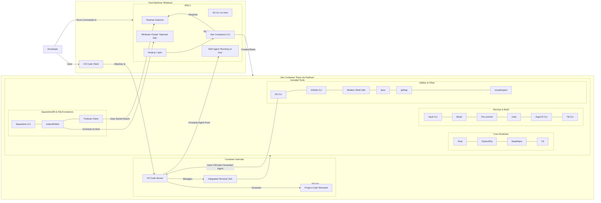
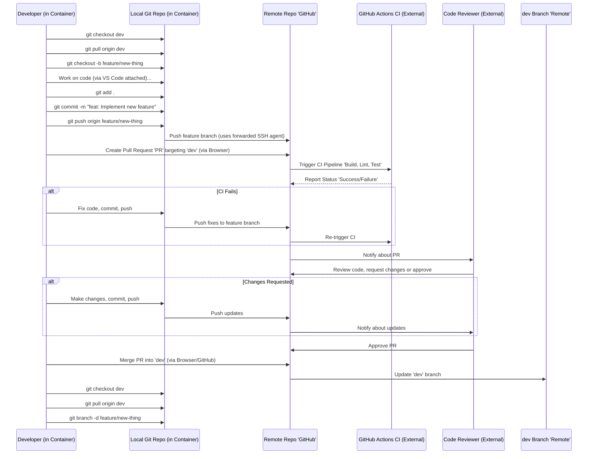

## **Dev Container Diagrams**

These diagrams illustrate the local setup and common workflows relevant to *using* this dev container template. Diagrams specific to a larger application architecture built *using* this template (like multi-environment K8s deployments, specific auth flows, CI/CD pipelines, or secrets management beyond the included Vault CLI) would belong in the consuming project's documentation.

### **1. Local Development Environment Setup**

This diagram shows the relationship between the host system, the Dev Container CLI, Podman, VS Code, and the running container with its tools.

**Explanation:** The developer initiates the environment using the Dev Containers CLI (devcontainer up) within WSL2. VS Code attaches to the running container. VS Code Server automatically forwards the running SSH Agent from the WSL host into the container. Tools inside the container use this forwarded agent or interact with the host via the Podman socket mount or network connections.

### **2. Git Feature Branch Workflow**

This diagram illustrates the standard process for contributing code changes *within* the dev container environment.

**Explanation:** Developers create feature branches from dev, work locally within the container, push the branch using the forwarded SSH agent, and open a Pull Request via the GitHub web UI. CI checks run. After code review and approval, the PR is merged.